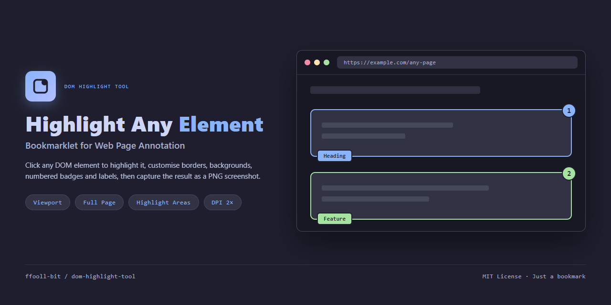

<div align="center">

<h1>DOM Highlight Tool</h1>



A bookmarklet for **highlighting DOM elements and capturing screenshots** — click any element to annotate it, customise borders, backgrounds, numbered badges and labels, then export the result as a PNG screenshot. Just a bookmark — no extension, no backend.

[](https://github.com/ffooll-bit/dom-highlight-tool/releases)
[](LICENSE)
[](https://github.com/ffooll-bit/dom-highlight-tool/actions/workflows/ci.yml)


</div>

## Demo

<p align="center">
  
  <br>
  <em>Page with active highlights</em>
</p>

<p align="center">
  
  
  
  <br>
  <em>Tool popup (left), area customisation (centre), badge &amp; label position adjusted (right)</em>
</p>

## Features

- Click any element to add a highlight
- Customise border colour, width, style (solid / dashed / dotted)
- Background colour and opacity
- Auto-numbered circular badges (adjustable position, size, colour, margin)
- Editable labels (adjustable position, font size, colour, margin)
- Per-highlight padding and margin
- Reorder or delete highlights
- Screenshot modes: **Viewport**, **Full Page**, **Highlighted Areas Only**
- DPI scaling: 1× or 2× for HiDPI captures
- Preview before download
- Lightweight — no extension, just a bookmark

## How It Works

<div align="center">

| Layer | Technology |
|---|---|
| Core logic | Vanilla JavaScript (no framework) |
| Screenshot capture | [html2canvas](https://html2canvas.hertzen.com/) (loaded from CDN) |
| Minification & build | [terser](https://terser.org/) via npm |

</div>

A **bookmarklet** is a browser bookmark that runs JavaScript instead of navigating to a URL. The entire tool is embedded in the bookmark — nothing to install.

## Install

1. Open [`bookmarklet.txt`](./bookmarklet.txt) in your browser and copy the entire content (starts with `javascript:`)
2. Create a new bookmark in your browser:
   - **Name:** `HL` (or anything you like)
   - **URL:** paste the copied code

## Usage

Three simple phases:

### Setup
1. Open the page you want to screenshot
2. Click the bookmark — the tool popup opens

### Highlight
3. Click **New** in the popup — the cursor changes to a crosshair
4. Click any element on the page — a highlight appears with a numbered badge
5. Customise colours, padding, badge and label position in the popup
6. Repeat for more highlights (colours cycle automatically)

### Capture
7. Select screenshot mode: **Viewport** / **Full Page** / **Highlight Areas**
8. Adjust DPI scale if needed (1× or 2×)
9. Click **Capture** — the preview appears
10. Click **Download** to save the PNG

> **Note:** Click the bookmark a second time to clean up all highlights and open a fresh popup.

## Browser Support

Tested on Chrome (desktop). Other browsers may work but have not been verified. A popup blocker may need to be disabled for the site.

## Known Limitations

- Does not support iframes or Shadow DOM
- `html2canvas` is loaded from CDN — an internet connection is required
- Cross-origin content may not render in screenshots due to browser CORS policy

## Files

<div align="center">

| File | Description |
|------|-------------|
| `highlight-tool.js` | Source code (readable, commented) |
| `highlight-tool.min.js` | Minified copy (generated via `npm run build`) |
| `bookmarklet.txt` | Bookmarklet URL — copy this into a bookmark |
| `CHANGELOG.md` | Release history |
| `CONTRIBUTING.md` | Contribution guide |
| `SECURITY.md` | Security policy and reporting |
| `LICENSE` | MIT licence |
| `docs/` | Screenshots and social preview |
| `.github/workflows/ci.yml` | CI pipeline (build + artifact drift check) |
| `package.json` | Build script and project metadata |

</div>

## Development

```bash
npm install
npm run build
```

This regenerates `highlight-tool.min.js` and `bookmarklet.txt` from `highlight-tool.js` using [terser](https://terser.org/).

## Contributing

See [CONTRIBUTING.md](CONTRIBUTING.md) for development setup, coding conventions and the pull-request workflow.

For bugs or feature requests, [open an issue](https://github.com/ffooll-bit/dom-highlight-tool/issues).

## License

[MIT License](LICENSE)
