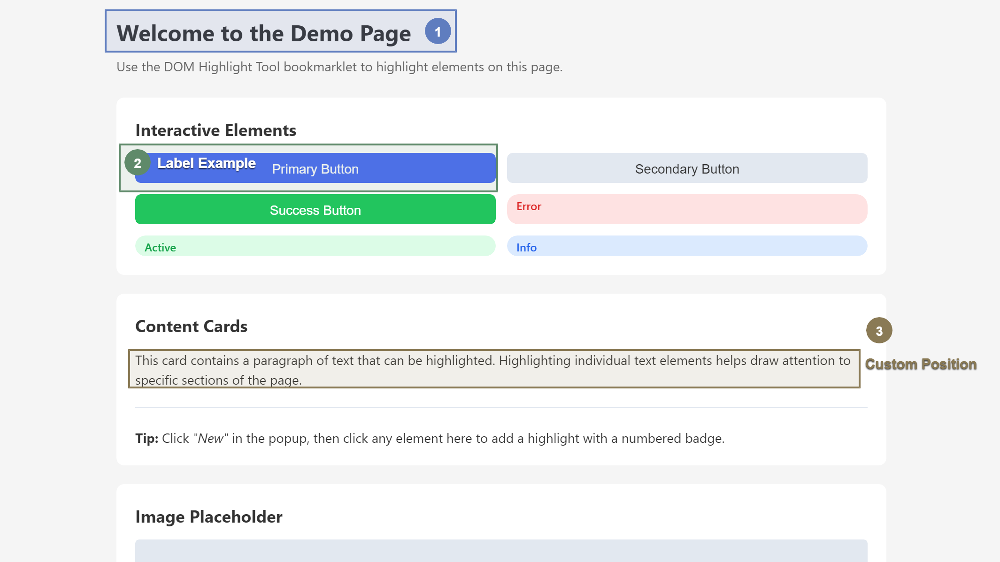
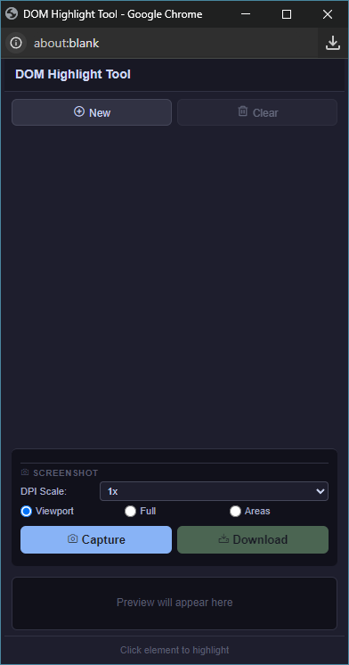
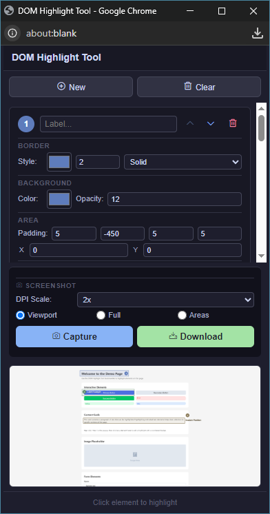
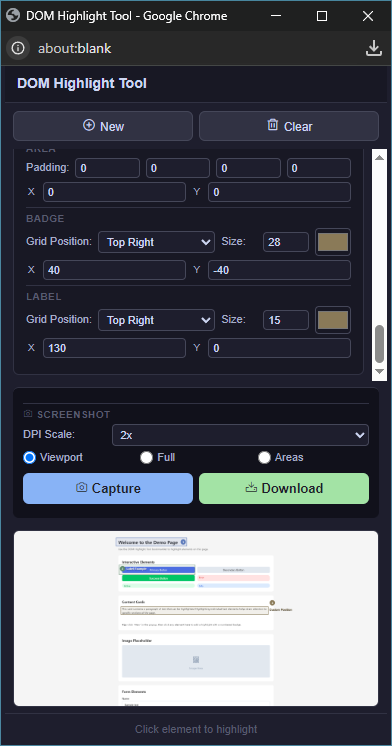

# DOM Highlight Tool

[](LICENSE)

A **bookmarklet** to visually highlight DOM elements on any web page and capture screenshots. Click elements, customize their appearance, and export the result as PNG.

## Screenshots

<p align="center">
  
</p>

<p align="center">
  
  
  
</p>

Try it yourself by opening [`demo.html`](./demo.html) in your browser and clicking the bookmark.

## Features

- Click any element on a page to add a highlight
- Customize border color, width, style (solid/dashed/dotted)
- Customizable background color and opacity
- Auto-numbered circular badges (adjustable position, size, color, margin)
- Editable labels (adjustable position, font size, color, margin)
- Padding and margin adjustments per highlight
- Reorder or delete highlights
- Screenshot modes: **Viewport**, **Full Page**, **Highlighted Areas Only**
- DPI scaling: 1× or 2× for HiDPI captures
- Preview before download
- Lightweight, no build step required — just a bookmark

## Install

1. Open [`bookmarklet.txt`](./bookmarklet.txt)
2. Copy the entire content (starting with `javascript:`)
3. Create a new bookmark in your browser:
   - **Name:** `HL` (or anything you like)
   - **URL:** paste the copied code

## Usage

1. Open the page you want to screenshot
2. Click the bookmark — a popup tool opens
3. Click **New** in the popup → cursor changes to crosshair
4. Click any element on the page → highlight appears
5. Customize colors, padding, badge/label position in the popup
6. Repeat for more highlights (colors cycle automatically)
7. Select screenshot mode (Viewport / Full Page / Highlight Areas)
8. Adjust DPI Scale if needed
9. Click **Capture** → preview appears
10. Click **Download** to save the PNG

Click the bookmark again on the same page to clean up all highlights and open a fresh popup.

## Limitations

- Does not support iframes or Shadow DOM
- Browser must allow popups (popup blocker)
- `html2canvas` is loaded from CDN — internet connection required
- Same-origin pages only (`localhost`, no cross-origin screenshots)

## Files

| File | Description |
|------|-------------|
| `highlight-tool.js` | Source code (readable) |
| `highlight-tool.min.js` | Minified version (generated via `npm run build`) |
| `bookmarklet.txt` | Bookmarklet URL — copy this into a bookmark |
| `demo.html` | Test page for trying the tool |
| `package.json` | Build script for minification |

## Development

```bash
npm install
npm run build
```

This regenerates `highlight-tool.min.js` and `bookmarklet.txt` from `highlight-tool.js` using [terser](https://terser.org/).

## License

MIT
